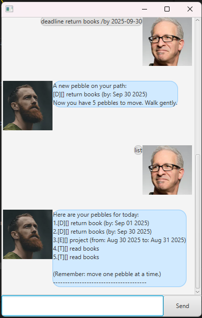

<!-- GENERATED WITH THE HELP OF COPILOT -->

# Uy: A Mindful Task Manager

A task management application with a calming, mindful twist.

## Features

- **Add Tasks:** Add todos, deadlines, and events to your list.
- **Mark/Unmark Tasks:** Mark tasks as done or not done.
- **Delete Tasks:** Remove tasks you no longer need.
- **List Tasks:** View all your current tasks.
- **Find Tasks:** Search for tasks containing a keyword.
- **Persistent Storage:** Your tasks are saved and loaded automatically.
- **Mindful Guidance:** Uy encourages you with calm, positive messages.

## Screenshot

Here’s how Uy looks in action:



## Getting Started

### Prerequisites

- Java 17
- JavaFX SDK (ensure it’s set up in your environment)
- Gradle (included in the project)

### Running the App

1. Open a terminal in the directory where the `uy.jar` file resides.
2. Run:
   ```
   java -jar uy.jar
   ```

### GUI Overview

- **Input Box:** Type your commands here.
- **Send Button:** Click or press Enter to submit your command.
- **Dialog Area:** See your conversation with Uy, with your messages on the right and Uy’s on the left.

## Command Reference

| Command Format                         | Example                                              | Description                                  |
| -------------------------------------- | ---------------------------------------------------- | -------------------------------------------- |
| `todo <description>`                   | `todo meditate`                                      | Adds a todo task                             |
| `deadline <desc> /by <date>`           | `deadline submit report /by 2025-09-21`              | Adds a deadline task                         |
| `event <desc> /from <date> /to <date>` | `event yoga retreat /from 2025-09-22 /to 2025-09-24` | Adds an event task with a start and end date |
| `list`                                 | `list`                                               | Lists all tasks                              |
| `mark <task number>`                   | `mark 2`                                             | Marks the specified task as done             |
| `unmark <task number>`                 | `unmark 2`                                           | Marks the specified task as not done         |
| `delete <task number>`                 | `delete 3`                                           | Deletes the specified task                   |
| `find <keyword>`                       | `find yoga`                                          | Finds tasks containing the keyword           |
| `bye`                                  | `bye`                                                | Exits the application                        |

- **Dates** should be in `yyyy-MM-dd` format (e.g., `2025-09-21`).

## Example Usage

```
todo meditate
deadline submit report /by 2025-09-21
event yoga retreat /from 2025-09-22 /to 2025-09-24
list
mark 2
unmark 2
delete 3
find yoga
bye
```

## Mindful Tips

Uy will encourage you with gentle, zen-like messages as you manage your tasks. Remember: “Move one pebble at a time.”

## Troubleshooting

- If you see a JavaFX warning about modules, ensure you are running with the correct JavaFX SDK and VM options.
- Your tasks are saved in `data/Uy.txt`. If you encounter loading issues, check this file.

## Credits

- Inspired by the SE-EDU JavaFX tutorial.
